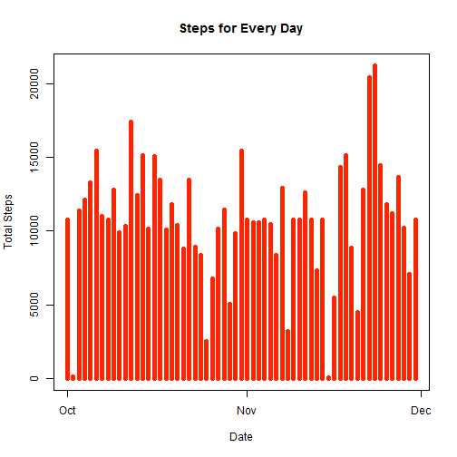
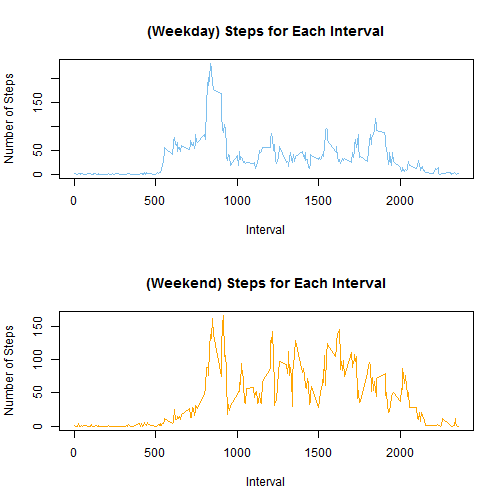

# Reproducible Research: Peer Assessment 1
**Author: F. QJ. F.**

This is a brief data analysis report for the dataset of research participants' daily movements. The whole course project is divided into the following 5 parts.
  

## Loading and preprocessing the data
First of all, we load the raw data set.

```r
setwd("D:/Study/Coursera_Reproducible Research/Project 1/repdata-data-activity")
act <- read.csv("./activity.csv")
str(act)
```

```
## 'data.frame':	17568 obs. of  3 variables:
##  $ steps   : int  NA NA NA NA NA NA NA NA NA NA ...
##  $ date    : Factor w/ 61 levels "2012-10-01","2012-10-02",..: 1 1 1 1 1 1 1 1 1 1 ...
##  $ interval: int  0 5 10 15 20 25 30 35 40 45 ...
```

"act" is the raw dataset and we can see the structure of each column in "act" by calling the srt() function.

To accomplish the first 3 parts, let us now transform the data types of certain columns for our later use. Then we check out missing data and filter those cases out.

```r
D <- act$date
S <- act$steps  ##Simplify column names
I <- act$interval
D <- as.Date(D)  ##Change the 'date' column of factor class to 'D' column of 
## Date calss
bad <- is.na(S)  ##'bad' is the label vector of NA's
S <- S[!bad]
D <- D[!bad]
I <- I[!bad]  ##Filter out missing observations

act2 <- matrix(rep(1, 30528), ncol = 2, nrow = 15264)
act2 <- data.frame(act2)
act2$D <- D
act2$S <- S
act2$I <- I
act2 <- act2[, -c(1, 2)]  ##'act2'is the processed dataset
head(act2)
```

```
##            D S  I
## 1 2012-10-02 0  0
## 2 2012-10-02 0  5
## 3 2012-10-02 0 10
## 4 2012-10-02 0 15
## 5 2012-10-02 0 20
## 6 2012-10-02 0 25
```

So far, we get the processed clean data, "act2", with simplified column names.
  

## What is mean total number of steps taken per day?
To calculate the daily total number of steps, we should split the data date-wise prior to computation and plotting.

```r
library(lubridate)
s <- split(act2, act2$D)
SUM <- sapply(s, function(x) sum(x[, c("S")]))
SUM <- data.frame(SUM)
SUM$D <- as.character(labels(SUM)[[1]])
SUM$D <- strptime(SUM$D, "%Y-%m-%d")  ##transform the 'D' column to POSIXlt/POSIXct 
## format
plot(SUM$D, SUM$S, type = "h", lwd = 5, col = "#ff2500", xlab = "Date", ylab = "Total Steps", 
    main = "Steps for Every Day")  ##Plot Histogram
```

```
## Warning: Name partially matched in data frame
```

 

Here we have got the histogram.
  
For calculating the mean and median total number of steps taken per day,

```r
head(SUM)
```

```
##              SUM          D
## 2012-10-02   126 2012-10-02
## 2012-10-03 11352 2012-10-03
## 2012-10-04 12116 2012-10-04
## 2012-10-05 13294 2012-10-05
## 2012-10-06 15420 2012-10-06
## 2012-10-07 11015 2012-10-07
```

```r
mean(SUM$SUM)
```

```
## [1] 10766
```

```r
median(SUM$SUM)
```

```
## [1] 10765
```

  

## What is the average daily activity pattern?
To calculate the mean value of steps with a certain 5-minute interval of each day, we should split the data interval-wise for the first thing.

```r
s2 <- split(act2, act2$I)
MEAN_Interval <- sapply(s2, function(x) colMeans(x[, c("S", "I")]))
MEAN_Interval <- data.frame(t(MEAN_Interval))
plot(MEAN_Interval$I, MEAN_Interval$S, type = "l", col = "navy", xlab = "Interval", 
    ylab = "Mean Steps", main = "Steps for Each Interval")  ##Time series plot
```

 

Besides, we may print out the maximum mean value.

```r
MAX_I <- MEAN_Interval[MEAN_Interval[, "S"] == max(MEAN_Interval$S), ][, 2]
MAX_MEAN <- MEAN_Interval[MEAN_Interval[, "S"] == max(MEAN_Interval$S), ][, 
    1]
paste("The 5-min interval that contains the maximum number of means of steps is the ", 
    MAX_I, "th one.", sep = "")
```

```
## [1] "The 5-min interval that contains the maximum number of means of steps is the 835th one."
```

```r
paste("And the maximum of the mean values is: ", MAX_MEAN, sep = "")
```

```
## [1] "And the maximum of the mean values is: 206.169811320755"
```

  

## Imputing missing values
By calling complete.cases() function, we are allowed to see how many (in)complete there are among all the columns from the raw data.

```r
table(complete.cases(act$date, act$interval, act$steps))
```

```
## 
## FALSE  TRUE 
##  2304 15264
```

It seems that there exist 2304 incomplete cases.
  
To fill in the missing numbers, we need to figure out their locations (in which column, primarily) in the data frame.

```r
any(is.na(act$date))
```

```
## [1] FALSE
```

```r
any(is.na(act$interval))
```

```
## [1] FALSE
```

```r
any(is.na(act$steps))
```

```
## [1] TRUE
```

It shows that all NA's are in the "steps" column.
  
We are going to **fill in the missing values with the mean value for corresponding 5-minute interval**. Then we may check if still there are any NA's in the filled dataset, "ACT".

```r
bad2 <- is.na(act$steps)  ##'bad2' is the label vector of NA's
ACT <- act
for (i in 1:17568) {
    if (is.na(ACT[i, 1]) == TRUE) 
        {
            ACT[i, 1] <- MEAN_Interval[MEAN_Interval[, "I"] == ACT[i, 3], 1]
        }  ##Substitute the NA's with the mean for corresponding 5-minute interval
}
any(is.na(ACT$date))
```

```
## [1] FALSE
```

```r
any(is.na(ACT$interval))
```

```
## [1] FALSE
```

```r
any(is.na(ACT$steps))
```

```
## [1] FALSE
```

Hence, "ACT" is a new data set without any NA's
  
Now we shall make a new histogram and calculate the new mean and median for the filled dataset.

```r
D2 <- ACT$date
S2 <- ACT$steps
I2 <- ACT$interval
D2 <- as.Date(D2)
ACT2 <- matrix(rep(1, 35136), ncol = 2, nrow = 17568)
ACT2 <- data.frame(ACT2)
ACT2$D2 <- D2
ACT2$S2 <- S2
ACT2$I2 <- I2
ACT2 <- ACT2[, -c(1, 2)]
s <- split(ACT2, ACT2$D2)
SUM2 <- sapply(s, function(x) sum(x[, c("S2")]))
SUM2 <- data.frame(SUM)
SUM2$D2 <- as.character(labels(SUM2)[[1]])
SUM2$D2 <- strptime(SUM2$D2, "%Y-%m-%d")
plot(SUM2$D, SUM2$SUM, type = "h", lwd = 5, col = "#ff2500", xlab = "Date", 
    ylab = "Total Steps", main = "Steps for Every Day")
```

 

```r
mean(SUM2$SUM)
```

```
## [1] 10766
```

```r
median(SUM2$SUM)
```

```
## [1] 10765
```

Compared to those in Part 2, apparently the mean and median numbers do not change at all, suggesting that such imputing has no impact of the exploratory analysis index of daily total steps number.
  

## Are there differences in activity patterns between weekdays and weekends?
We attempt to create a new factor variable, which will be added to the dataset, with two levels (i.e. "weekday" and "weekend"). With the help of weekdays() function in the "lubridate" R-package, we may easily manage that.

```r
AC <- ACT
AC$date <- strptime(ACT$date, "%Y-%m-%d")  ##transform the 'date' column 
## to POSIXlt/POSIXct format
AC$Wkd <- weekdays(AC$date)  ##Create a 'Wkd' column indicating weekdays
Wk <- rep("A", nrow(AC))
AC$Wk <- Wk
for (i in 1:nrow(AC)) {
    if (AC[i, 4] == "Saturday" | AC[i, 4] == "Sunday") {
        AC[i, 5] <- "weekend"
    } else {
        AC[i, 5] <- "weekday"
    }
}  ##Create a 'Wk' column indicating whether weekdays days
## or weekend days
head(AC)
```

```
##     steps       date interval    Wkd      Wk
## 1 1.71698 2012-10-01        0 Monday weekday
## 2 0.33962 2012-10-01        5 Monday weekday
## 3 0.13208 2012-10-01       10 Monday weekday
## 4 0.15094 2012-10-01       15 Monday weekday
## 5 0.07547 2012-10-01       20 Monday weekday
## 6 2.09434 2012-10-01       25 Monday weekday
```

Finally, we make a panel plot containing a time series plot of the 5-minute interval (x-axis) and the average number of steps taken, averaged across all weekday days or weekend days.  
Instead of using lattice graphics system in the example, we use base graphics system here.

```r
AC_1 <- AC[AC[, "Wk"] == "weekday", ]
AC_2 <- AC[AC[, "Wk"] == "weekend", ]
s_1 <- split(AC_1, AC_1$interval)
s_2 <- split(AC_2, AC_2$interval)
MEAN_Interval_1 <- sapply(s_1, function(x) colMeans(x[, c("steps", "interval")]))
MEAN_Interval_2 <- sapply(s_2, function(x) colMeans(x[, c("steps", "interval")]))
MEAN_Interval_1 <- data.frame(t(MEAN_Interval_1))
MEAN_Interval_2 <- data.frame(t(MEAN_Interval_2))
par(mfrow = c(2, 1))
plot(MEAN_Interval_1$interval, MEAN_Interval_1$steps, type = "l", col = "skyblue2", 
    xlab = "Interval", ylab = "Number of Steps", main = "(Weekday) Steps for Each Interval")
plot(MEAN_Interval_2$interval, MEAN_Interval_2$steps, type = "l", col = "orange", 
    xlab = "Interval", ylab = "Number of Steps", main = "(Weekend) Steps for Each Interval")
```

 

